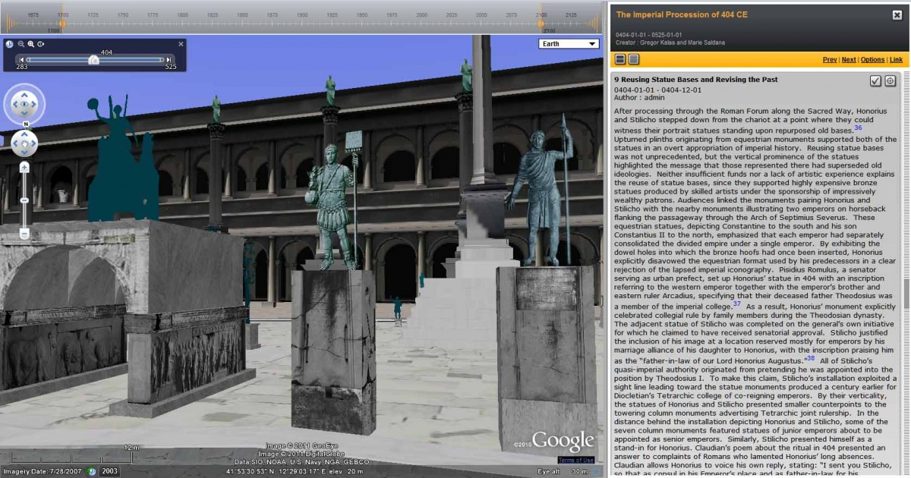
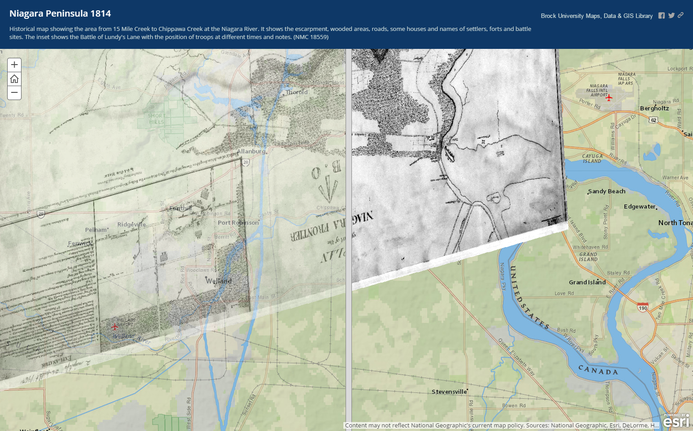
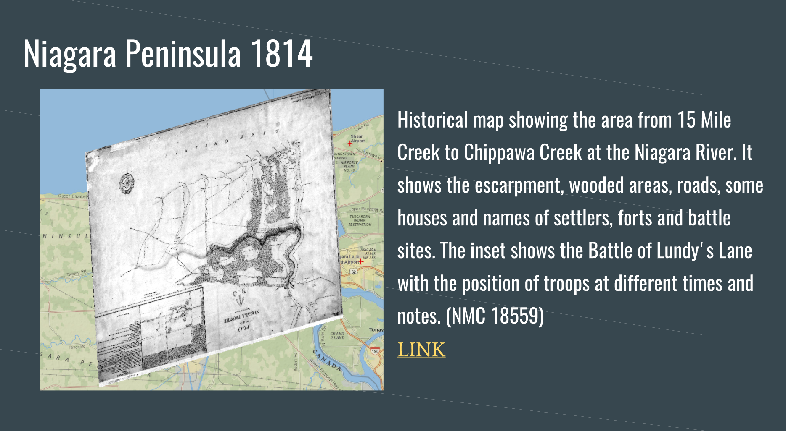

### Collaborative Project

This collaborative project was to introduce HyperCities which is historic/social mapping tool utilizing uprising digital mapping and GPS technology. Although it provides functions and uses of the HyperCities, it also introduces Brock ArcGIS due to technical difficulty. Brock ArcGIS is another web based program delivering similar functions but at smaller but equally detailed scale. By using Brock ArcGIS, I was able to find archaeology of Niagara Region such as map of Niagara Peninsula 1814 and Fire Insurance Plans, St. Catharines 1935. These maps were full of detailed data such as old road plan, general house floor plan of past and even military war plan from early 1800.

Although collaborative projects requires combined effort, our group’s approach to this project was very divided up. By dividing up entire project into 4 categories based on guide lines, one was to take Project introduction/overview, one was to demonstrate and discover, one was to discuss the usability of the tool and theoretical discussion was to work collaboratively. Although my take on this collaborative work was to demonstrate and discover using the tools of our pick, due to lack of contribution from others theoretical discussion part was left for me to finish. Due to different personal schedules and for convenience, most of communications were done through email. This lead into rather minimal communication between members and very little discussion were done between members of the group focusing only on their given category. Due to technical difficulty that I faced accessing actual HyperCities, I have invested quite some time to find suitable replacement of HyperCities. Thanks to my previous short encounter from past and with help of Brock GIS library access and librarian, I was quickly able to identify and learn about Brock ArcGIS program. Although there was much stronger and detailed installation program available other than Brock ArcGIS, I have decided to go with Brock ArcGIS instead of it due convenient web based form to demonstrate during presentation.

[Collaborative Project](https://docs.google.com/presentation/d/1_s12Wu4dtM6_Yki44wRjxHmOMix60J7kFIRavnyEPzc/edit?usp=sharing)
